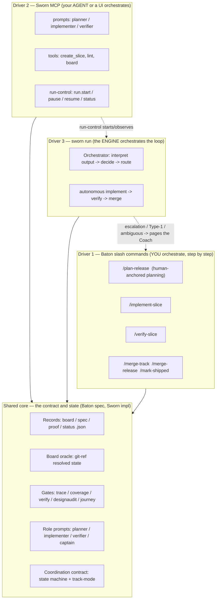

# The surface seam — slash commands vs MCP vs the full Sworn experience

**Date:** 2026-06-27. Working artefact to resolve the recurring confusion about how Baton slash commands, Sworn's MCP, and `sworn run` relate. Promote to a reference doc / ratify as a Rule-10 journey in the combined release.

## The resolving principle

**Three drivers, one core.** All three surfaces drive the *same* roles over the *same* board, records, and gates. What differs is **who orchestrates**, on a ladder of increasing automation:

| Driver | Who orchestrates | The human is… | Use when |
|---|---|---|---|
| **Baton slash commands** (`/plan-release`, `/implement-slice`, …) | **You**, step by step, in your agent (Claude Code / Codex) | the orchestrator | you want full manual control; planning (always human-anchored); a tricky slice; or you have no binary (the by-hand tier) |
| **Sworn MCP** (prompts + tools + run-control) | **Your agent or a UI**, programmatically | the operator of an agent | you want your own agent or a UI to drive verified delivery, with Sworn as the toolbelt |
| **`sworn run`** (the engine) | **Sworn**, the whole loop | the Coach, who is paged | you want unattended delivery over an already-planned board |

They are **not three products**. They are three entry points onto one shared core, and they **interoperate** over that core and **degrade into each other**: plan by hand, run autonomously, drop back to a slash command for an escalated slice, observe over MCP/TUI — all against the same board.

### The chat-agent supervisor (the most accessible path today)

A chat agent (Claude Code, Codex, …) is a flexible **meta-driver**: it can operate any of the three surfaces on your behalf — issue slash-command prompts to itself, call Sworn's MCP tools, *or* run `sworn` subcommands and `sworn run` directly via **bash** and supervise the loop. When it supervises `sworn run`, it acts as an **external orchestrator / interpreter**: it reads Sworn's output, interprets it, and intervenes — externally filling the interpreter gap Sworn lacks internally today (the missing `dispatch_and_interpret`). This is the lowest-setup end-to-end path (any agent + bash, no MCP wiring) and it is how this very project has been operated.

**Implication for FT-1 (the interpreter):** the interpret-and-decide layer can live **inside** Sworn (the engine's own interpreter — required for truly unattended / hosted operation) **or outside** it (a supervising chat agent). Both are valid; the internal one is what makes hands-off autonomy possible, the external one is the cheap accessible path that works today. Build the internal one, but recognize the chat-agent-supervisor is a first-class way to run Sworn end to end and should be a declared journey.

## Process chart

## The seam clarities (what resolves the ambiguity)

1. **Planning is always human-anchored**, never the autonomous engine — via `/plan-release` (slash) or MCP `create_slice` (agent-assisted). `sworn run` starts at *implement*, over an already-planned board. (`sworn run --task` is the one exception today: a degenerate single-slice stub; decision pending to make it a real single-slice planner-assist quickstart.)
2. **Slash commands and `sworn run` are the same roles at different automation.** `/implement-slice` = you dispatch the implementer; `sworn run` = the engine dispatches the implementer. Same role, same spec, same board, different driver.
3. **MCP is the programmatic projection of both** — it exposes the role prompts, the planning/board/gate tools, and run-control, so a UI or an external agent can drive any of it.
4. **The full experience subsumes the manual one and degrades to it.** `sworn run` pages the Coach on escalation; the Coach resolves with a slash command, then the loop resumes. The manual surface is the floor the autonomous one falls back to — which is why it must stay first-class.

## Primary customer journey — "Ship a release" (traverses all three)

1. **Plan** — Coach runs `/plan-release` (Driver 1, human): conversational intake, decomposition, ACs, tracks → board + specs.
2. **Run** — Coach runs `sworn run --release` (Driver 3, autonomous): implement → verify → merge per slice, unattended.
3. **Observe** — Coach watches via the TUI / home screen, or a UI over MCP run-control (Driver 2).
4. **Escalate** — on a BLOCKED verdict, a Type-1 design fork, or an ambiguous outcome, the loop pages the Coach; Coach drops to `/replan-release` or `/implement-slice` (Driver 1) to resolve, then resumes the loop.
5. **Ship** — release merges; Coach runs `/mark-shipped` (Driver 1).

One outcome, all three surfaces, complementary not competing. This is a strong candidate **Rule-10 critical journey** to declare and walk for the combined release (no-mock boundary = a real board, real gates, real escalation), alongside keyless-full-loop and the loop-verifier negative scenario.

## Open seam decisions for plan-release

- `sworn run --task`: **RATIFIED (direction C)** — becomes a real single-slice planner-assist quickstart (planner drafts a concrete-AC spec from the task, then implement+verify), not the current faked stub. Fixes the Rule-8 vague-AC + example.com-schema bugs.
- Whether MCP run-control (`run.start/pause/resume/status`) is the canonical UI integration path (per the orchestration-surfaces decision: "MCP server owns the long-running loop").
- Where the hosted layer attaches (it wraps Driver 3 + the moat data; out of scope for this public-safe artefact).
